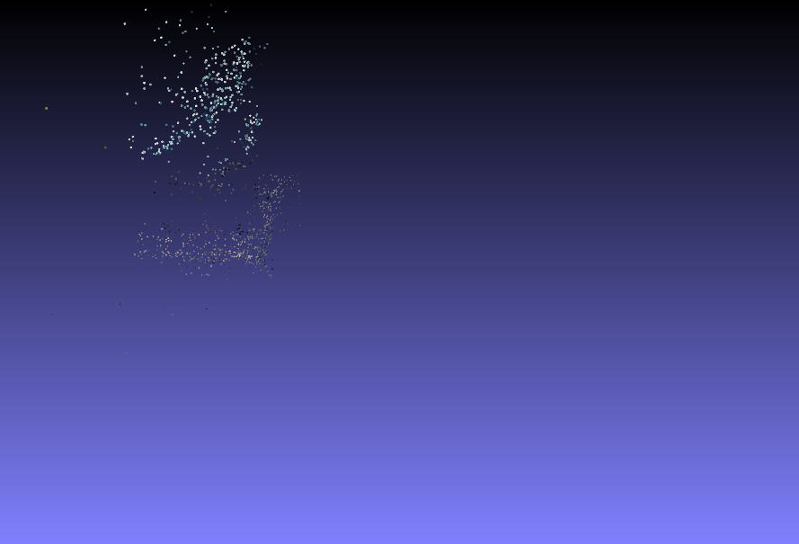

## Structure from motion
### Full pipeline for sparse 3D reconstruction

00.jpg  | 01.jpg | 02.jpg | 03.jpg | 04.jpg |
:------:|:-------:|:------:|:-------:|:-------|
  |   |  |  |  |

| sample1 | sample2 |
:--------:|:--------:| 
| |  |
<b></b>

B21.jpg  | B22.jpg | B23.jpg | B24.jpg |
:-------:|:-------:|:-------:|:-------:|
  |   |  |  |

| sample1  | sample2 |
:------:|:--------:| 
| |  |

### Build project
```
mkdir build
cd build
cmake ..
make -j2
```
For run - prepare image data set and config file in json format like in examples [1](/resource/data/relief/config.json) and [2](/resource/data/figure/config.json):
```
./SfM --f data/figure/config.json --o some3d.ply
```
Output data represented as a file with vertices in [.ply](http://paulbourke.net/dataformats/ply/) format. For open use [MeshLab](https://meshlab.net/).

### Used third-party library:
* [Eigen 3.4](https://eigen.tuxfamily.org)
* [Ceres-Solver](http://ceres-solver.org/)
* [OpenCV 4.2](https://github.com/opencv/opencv)
* [Boost 1.71](https://www.boost.org/)
* [nlohmann/json](https://github.com/nlohmann/json)
* [nmwsharp/happly](https://github.com/nmwsharp/happly)


### Used references:
* [3dv_tutorial](https://github.com/sunglok/3dv_tutorial/releases/download/misc/3dv_slides.pdf) 
* [SFMedu](https://3dvision.princeton.edu/courses/SFMedu/)
